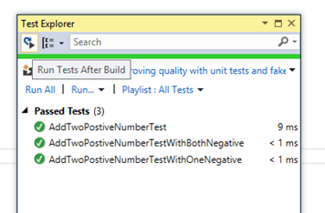

# GoogleOcr

[Google Vision API](https://cloud.google.com/vision) is just great. If you ever played with Google Photo App, you will be impressed at how easy it is to extract the texts out of an image, and copy the `street address`, business card `names`, `phone number` etc.

How about a simple C# class to do the OCR in  a few lines of code? That is what exactly this repo does for you. This repository wraps Google Vision API with a handy utiity class `GoogleOcr` to perform text extraction from images or PDF files.


```CSharp
var text = GoogleOcr.Load("Samples/TIFF/Abc.tif");  // TIFF file
var text = GoogleOcr.Load("Samples/TIFF/Abc.pdf");  // PDF file
// Do whatever with the recognized texts
```


------

# How to get Started
## Set up a project in Google Cloud Console (Method I) 

1. Follow [Quickstart: Using client libraries](https://cloud.google.com/vision/docs/quickstart-client-libraries) to create a Google Cloud project. 
2. After setup, you will get a key json file, download it and save it to a local file, e.g. c:\abc\key.json


## Set up a project using Google Cloud Shell (Method II: Recommended)

1. Follow this [CodeLabs tutorial](https://codelabs.developers.google.com/codelabs/cloud-vision-api-csharp#0) to create a new project
2. Open a Cloud Shell and type below code

```
gcloud auth list
gcloud services enable vision.googleapis.com
export GOOGLE_CLOUD_PROJECT=$(gcloud config get-value core/project)
gcloud iam service-accounts create my-vision-sa --display-name "my vision service account"
gcloud iam service-accounts keys create ~/key.json --iam-account my-vision-sa@${GOOGLE_CLOUD_PROJECT}.iam.gserviceaccount.com
export GOOGLE_APPLICATION_CREDENTIALS=~/key.json
```

Then run below code (in the **cloud shell**, not your own **~~host shell/terminal~~**) and copy the `key.json` file content to the clipboard 📋
```
cat ~/key.json | pbcopy
```

- In your development/host machine (not **~~Google Cloud Shell~~**), paste the content and save it to a file `key.json`
- Set the environment variable GOOGLE_APPLICATION_CREDENTIALS to the path of the JSON file that contains your service account key. 

## Setup your json file path locally

- <span style="color:blue">**This step is important if you want to test this repo successfully! You have too properly set your json config location!**
- <span style="color:blue">**If you fail to run the example project, you need first to check this**

Set the environment variable GOOGLE_APPLICATION_CREDENTIALS to the path of the JSON file that contains your service account key.
   - Follow [this article](https://www.architectryan.com/2018/08/31/how-to-change-environment-variables-on-windows-10/) if you want to do so interactively via point-and-click:

     

   - Programatically:

      ```shell
      setx GOOGLE_APPLICATION_CREDENTIALS /Your/Json/File/Path
      ```

# Doing is believing: Run the examples to see how it works
- Open the `GoogleOcrLibTests` project
- In VisualStudio, Open Test Explorer: Run the test cases (Right click --> Run tests)

  

Example:
```CSharp
    var text = GoogleOcr.Load("Samples/Gif/TestClass.gif");
    Assert.IsNotNull(text);
    Assert.IsTrue(text.Contains("TestClass"));
    Assert.IsTrue(text.Contains("GoogleOcrTests"));
```


------ 


## References

- [.NET reference documentation for the Cloud Vision API.](https://googleapis.dev/dotnet/Google.Apis.Vision.v1/latest/api/Google.Apis.Vision.v1.html)
- [Using the Vision API with C#](https://codelabs.developers.google.com/codelabs/cloud-vision-api-csharp#0)
